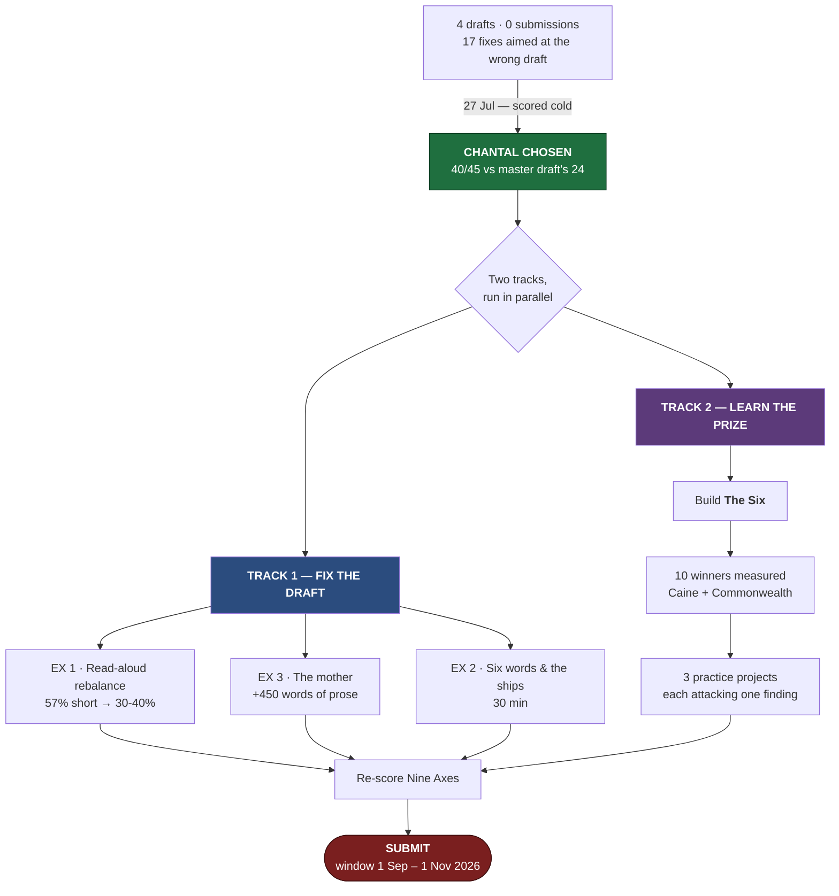
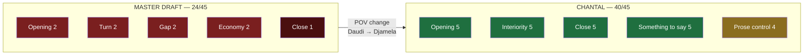
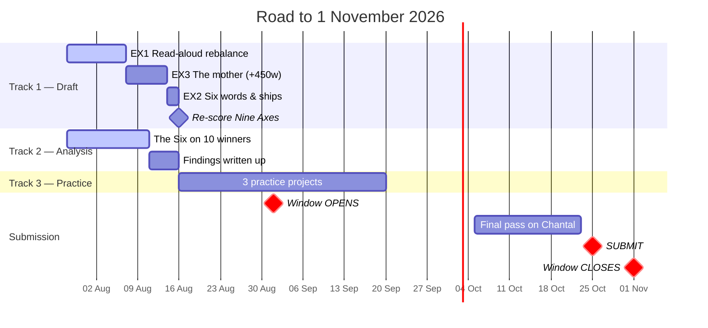
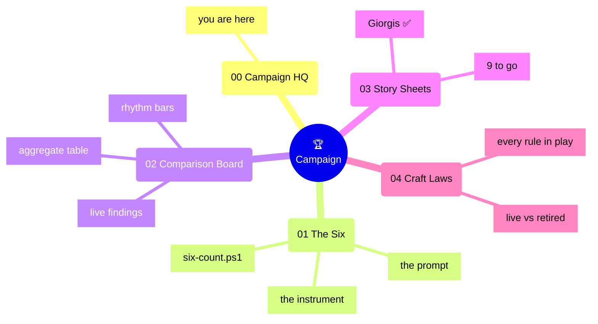

# 🏆 CAMPAIGN HQ

> [!abstract] The whole operation on one page
> **Submission:** [[2026-07-26 — Chantal (Djamela POV, Draft 2 — Barrett Pass)|Chantal]] · Djamela, first person · **3,407 words** · scored **40/45**
> **Target:** Commonwealth Short Story Prize · **window 1 Sep – 1 Nov 2026**
> **Detailed plan:** [[Chantal — Prize Plan]] · **Instrument:** [[01 The Six — Analysis Instrument]] · **Data:** [[02 Comparison Board]]

---

## The Campaign

---

## Where the score comes from

**The decisive axis was 3, not 9.** Both drafts have something to say. Only one knows what the girl won't say — because she is the one saying it.

---

## 14 weeks

> [!warning] Submit by 25 October, not 1 November
> A week of margin. Nothing about this prize rewards submitting on the last day, and everything about a portal at midnight punishes it.

---

## Status board

| | Item | State |
| :--: | --- | --- |
| ✅ | Submission draft chosen | Chantal · 40/45 |
| ✅ | Deadline found | **1 Sep – 1 Nov**, annually |
| ✅ | Old apparatus retired | 53 questions + 3 hybrids |
| ✅ | Analysis instrument built | [[01 The Six — Analysis Instrument]] |
| ✅ | **Draft 3 written** | 3,569w · **49%** · [[2026-07-28 — Chantal (Draft 3, Prize Pass)]] |
| ✅ | **EX 1 — read-aloud rebalance** | **done and validated** — 57% → 49%, inside the measured band |
| ✅ | Late reframe implemented | 85.1% · [[05 The Late Reframe]] · independently validated by story 2 |
| ✅ | Pregnancy destiny settled | Barrett's rule closed |
| ✅ | Stories 1–2 of 10 measured | Giorgis · Uwazuruike |
| 🔴 | Controlling idea for Chantal | **still undecided** — the last open decision |
| 🟡 | EX 3 — the mother | commentary rationing now lifted |
| 🟡 | EX 3 — the mother | not started |
| 🟡 | EX 2 — six words & ships | not started |
| 🟡 | Stories 2–10 | not started |
| 🟢 | 3 practice projects | undefined — generated *by* the analysis |
| 🟢 | Motherboard cut from Daudi drafts | only one story may hold it |

---

## Map of this folder

## Elsewhere in the vault

- [[Chantal — Prize Plan]] — the detailed draft-level plan, exercises, open decisions
- [[Dashboard]] — **archive** below the Craft Cheat Sheet; aimed at a draft that is not shipping
- [[The Judging Rubric — Nine Axes]] — the scoring instrument
- [[Collection Tracker]] — story-cycle planning; the motherboard exclusivity problem lives here
