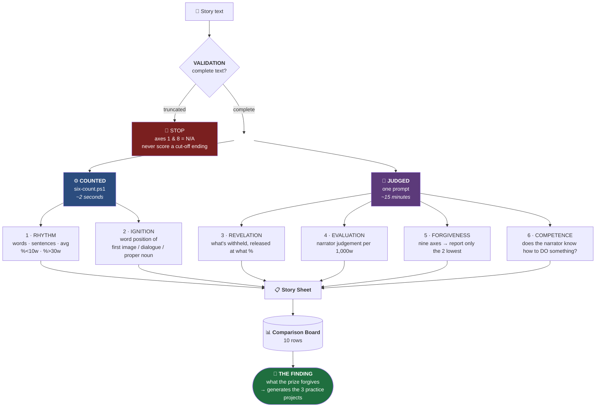
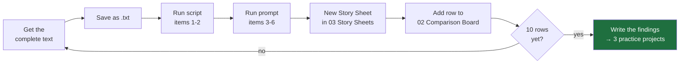

# 🔬 THE SIX — ANALYSIS INSTRUMENT

> [!abstract] What this is
> An 80/20 instrument for reading prize winners **adversarially**. Cut from twelve measurements to six by one test: *does this number change a decision about Chantal?*
> Everything merely interesting was removed.

> [!danger] The one rule that makes it work
> **You are not asking "why is this good?" You are asking "what did the prize forgive?"**
> Scoring winners for their strengths teaches nothing — they all score high, and the totals compress at the top. The information is in the **two lowest axes**. Every winner has two.

---

## The pipeline



---

## The six, and why each earns its place

| # | Measurement | Layer | The decision it changes |
| :--: | --- | :--: | --- |
| **1** | **RHYTHM** | ⚙️ counted | *Is Chantal's 57% short sentences actually a defect, or is it what wins?* |
| **2** | **IGNITION** | ⚙️ counted | *How fast does a winner really start?* The First-Page Cut, made numerical |
| **3** | **REVELATION** | 🧠 judged | *Chantal withholds the hotel entirely and drops the pregnancy at 72%. Normal or extraordinary?* |
| **4** | **EVALUATION** | 🧠 judged | *Barrett said 5 aphorisms might be one too many. He was guessing. This measures it* |
| **5** | **FORGIVENESS** | 🧠 judged | *What does this prize let you get away with?* — highest-value line on the sheet |
| **6** | **COMPETENCE** | 🧠 judged | *Tests the hypothesis that domain knowledge differentiates. Currently 0 for 1* |

> [!note] What was cut, and why
> **Duration map** (Genette scene/summary/ellipsis/pause) — fascinating, drives no current decision.
> **Perception verbs** — Chantal already passes.
> **Untranslated language** — Chantal already does it right and won't change.
> **Words after climax** — already measured on Chantal (~45).
> Keep these in reserve. If a finding demands them, add them back.

---

## The prompt

Paste the story above it. The no-preamble instruction is the one thing worth copying verbatim from [[Story hackers automation|the automation this was modelled on]].

```text
Analyse the short story above. Output ONLY the sections below, as headed
markdown. No preamble, no summary, no closing commentary.

## VALIDATION
Report the word count of the text supplied. State whether the text begins at
the story's first sentence and ends at its last. If the text appears truncated
at either end, say so explicitly and DO NOT score axes 1 or 8 — report them as
N/A rather than as a low score.

## REVELATION
The three most significant facts the story withholds from the reader. For each:
what it is, the exact sentence that releases it, and the percentage of the way
through the story that sentence falls. If a fact is never released, say so and
explain what stands in for it.

## EVALUATION
Sentences where the narrator stops narrating to tell the reader what something
means, or what it is worth, or why it matters. List the count, express it per
1,000 words, and quote the three strongest verbatim. Do not count dialogue.
Do not count description. Only narratorial judgement.

## FORGIVENESS
Score the story 1-5 on each of the nine axes: opening authority, prose control,
character interiority, scene turn, the gap, structural economy, controlling idea,
resonant close, something to say. Report the total, then report ONLY the two
lowest-scoring axes, each with two sentences defending the low score against
the fact that this story won. State plainly what the prize forgave.

## COMPETENCE
Does the narrator know how to do something — a trade, a craft, a procedure, a
professional or technical body of knowledge — such that the story contains
information a general reader would not have? Answer Y or N. If Y, name the
domain and quote one sentence that could only have been written by someone who
possesses it. If N, say what the narrator has instead.
```

> [!bug] VALIDATION was added after it cost us a full pass
> The first run on [[Giorgis — A Double-Edged Inheritance]] was done on a **truncated** paste. The analysis noticed the cut-off under REVELATION, then failed to carry that fact into the scoring — it gave resonant close a **1** for an ending lost in transit, and built its headline verdict (*"the prize forgave an unfinished story"*) on the artefact. True score with the full text: **33/45**, with resonant close a **5**.

---

## The counting script

`six-count.ps1`, committed alongside this note.

```powershell
.\six-count.ps1 -Path ".\story.txt" -Markers @("a sentence to locate", "another one")
```

Returns rhythm, ignition, and the **% position** of any marker sentence — which is how REVELATION percentages get measured rather than estimated.

> [!warning] Known limitation
> Detects dialogue by quotation marks. **Chantal renders speech unquoted**, so it reports "no dialogue" on the live draft. Not a flaw in the draft — a blind spot in the script. Needs an unquoted-dialogue heuristic before the ignition column means anything for first-person unquoted narrators.

---

## Running order



**Hard cap: two weeks.** Ten stories × full apparatus is three weeks and it will not get a story finished. Analysis is comfortable in a way submitting is not — and this vault has already produced four drafts and zero submissions.

## Sources behind the instrument

- **Piper, Xu & Kolaczyk** — *Modeling Narrative Revelation* → item 3. [Paper](https://ceur-ws.org/Vol-3558/paper6166.pdf)
- **Labov & Waletzky** — the evaluation model → item 4
- **Genette** — order/duration/frequency/focalization → held in reserve
- [[The Judging Rubric — Nine Axes]] → item 5
- [[04 Craft Laws — Reference Card]] — every rule in play, live and retired
