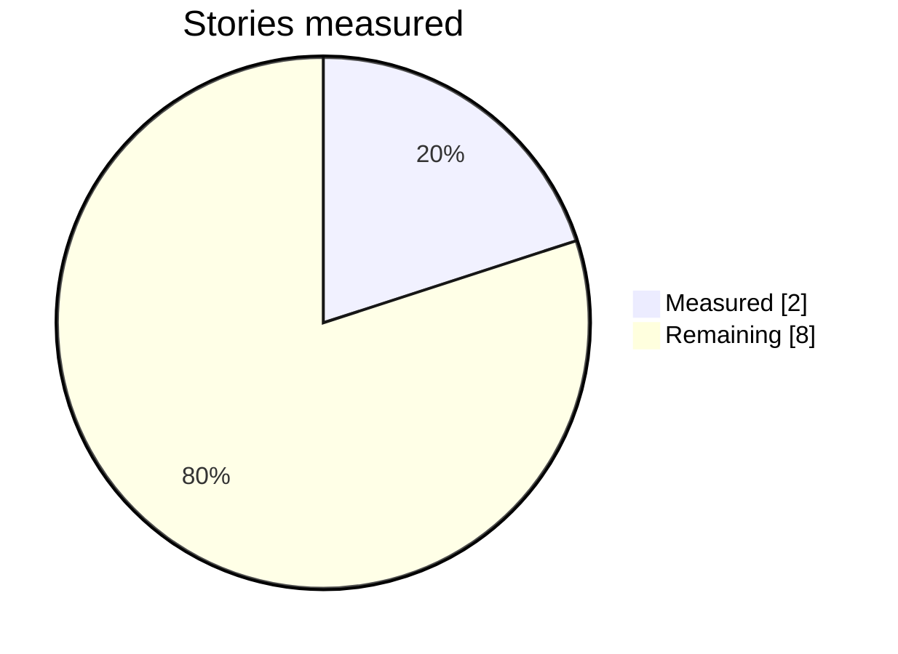

# 📊 COMPARISON BOARD

> [!abstract] Progress
> **2 of 10 stories measured.** Every row is a verdict on Chantal, not an observation about somebody else.
> Instrument: [[01 The Six — Analysis Instrument]] · Sheets: `03 Story Sheets/`

> [!note] Also scored — the two gates this board does not cover
> [[08 Three Gates — Field Comparison]] runs all four stories through the floor and the risk gate of [[The Three Gates — Unified Instrument]]. It produces a combined ranking that puts **Chantal above both placed stories**, and then argues at length that this board is the more trustworthy of the two where they disagree. **Read this one first.**



---

## The aggregate

| Story | Words | %&lt;10w | Avg | &gt;30w | 1st noun | Eval /1k | Score | 2 weakest | Comp? |
| --- | --: | --: | --: | --: | --: | --: | --: | --- | :--: |
| 🏆 [[Baldwin — Sonny's Blues\|**BALDWIN — Sonny's Blues**]] *(benchmark)* | — | — | — | — | — | **highest** | **44** | economy only | **Y** *(qualified)* |
| **CHANTAL D3** *(ours)* | 3,674 | **48%** | 14.7 | 10% | w16 | low\* | **40** | 2 · 7 | **Y** |
| [[The Beat of My Hurt (Draft 4 — Free)\|**BEAT D4**]] *(Claude's)* | 3,476 | **51%** | 14.5 | **13%** | w80 | mid | **~41**† | prose control | **Y** |
| [[Giorgis — A Double-Edged Inheritance\|Giorgis — Double-Edged Inheritance]] | 5,179 | **30%** | 14.9 | 5% | w14 | 8.1 | 33 | prose · interiority | **N** |
| [[Uwazuruike — Looking for Papa\|Uwazuruike — Looking for Papa]] | 4,035 | **49%** | 11.0 | 2% | w17 | 11.9 | 33 | opening · prose | **N** |
| *4* | | | | | | | | | |
| *5* | | | | | | | | | |
| *6* | | | | | | | | | |
| *7* | | | | | | | | | |
| *8* | | | | | | | | | |
| *9* | | | | | | | | | |
| *10* | | | | | | | | | |

\* *Chantal's aphorism count (5, Barrett) is not the same measure as evaluative sentences (Labov). Still needs re-counting on the same definition — but see the finding below, which has already settled the decision it was meant to inform.*

---

## ⛔ RETIRED — rhythm

> [!danger] There is no winning rhythm. This metric is closed.
> | Story | Avg | %&lt;10w | Quality |
> | --- | --: | --: | --- |
> | Uwazuruike | **11.0** | 49% | placed |
> | Chantal D3 | 14.7 | 48% | ours |
> | Giorgis | 14.9 | **30%** | placed |
> | **Baldwin** | **longest by far** | **lowest** | **44/45 — the best** |
>
> Three good stories, three completely different profiles. Uwazuruike places at 11.0 words a sentence; Baldwin wins everything at several times that.
> **The metric detects outliers. It cannot set a target.** Chantal's 48% is fine — and so was 57%. Two passes were spent chasing this number; the mother detonation bought more in one paragraph than either of them did.

## ~~SETTLED~~ — rhythm *(superseded by the above)*

```
Sentences under 10 words

Giorgis        30%  ██████░░░░░░░░░░░░░░
Uwazuruike     49%  ██████████░░░░░░░░░░
CHANTAL D3     49%  ██████████░░░░░░░░░░   ← inside the band
Chantal D2     57%  ███████████░░░░░░░░░   ← outside it
```

**Two placed stories, 30% and 49%. The band is wide, and Draft 3 sits inside it while Draft 2 sat outside it.**

The rebalance was right, and it was right to **stop at 49% rather than chase 30%**. Exercise 1 is closed.

| | Giorgis | Uwazuruike | **Chantal D3** |
| --- | --: | --: | --: |
| Words | 5,179 | 4,035 | 3,569 |
| Average length | 14.9 | 11.0 | 14.4 |
| Under 10 words | 30% | 49% | **49%** |
| Over 30 words | 5% | 2% | 10% |

> [!success] Second finding: long sentences are not required
> Uwazuruike places with **2%** of sentences over 30 words — a quarter of Chantal's rate. Barrett's *"long = interiority"* is a permission, not an obligation. Chantal's 10% is fine; so would 3% be.

---

## ✅ CLOSED — stop cutting commentary

| | Eval per 1,000 words | Quality |
| --- | --: | --- |
| 🏆 **Baldwin** | **highest of all** | the best story measured |
| Uwazuruike | **11.9** | placed · 33/45 |
| Giorgis | **8.1** | placed · 33/45 |
| **Chantal** | **lowest** | 40/45 |

**The correlation runs the opposite way to Barrett's worry.** The most evaluative story on the board is the best one. Barrett's *"five aphorisms may still be one too many"* is **firmly miscalibrated** — three independent confirmations. The commentary was never the problem; the full stops were.

## 🏆 THE CEILING — what the benchmark establishes

[[Baldwin — Sonny's Blues]] scores **~44/45**, losing its only point on **structural economy** — it is long, the flashbacks sprawl, and it does not matter.

**The pattern now holds across all three measured stories:**

| Story | Loses points on | Wins on |
| --- | --- | --- |
| Baldwin | architecture (economy) | voice · interiority · close |
| Uwazuruike | architecture (opening, economy) | voice · reversal |
| Giorgis | architecture (prose, interiority) | design · revelation |
| **Chantal** | **prose control · controlling idea** | **architecture** |

> [!warning] Chantal is the inverse shape
> Every story measured **loses on architecture and wins on voice**. Chantal wins on architecture and is weakest on voice-level axes.
> **These panels forgive structure. They do not forgive voice.** That is the most consequential finding on this board and it should govern the final pass.

**Consequence:** material coming out of [[Chantal — Prize Plan|Exercise 3]] no longer needs to be rationed for fear of over-narrating.

---

## Revelation architecture

Where each story releases what it withheld. Bar fills to position.

**Giorgis — *A Double-Edged Inheritance***

| % | The release | Position |
| --: | --- | --- |
| 46.4 | Tigist dies — in a subordinate clause | `█████████░░░░░░░░░░░` |
| 62.7 | Robel is alive, and is her father | `█████████████░░░░░░░` |
| 83.4 | **THE NOTE** — accident becomes murder | `█████████████████░░░` |
| 99.7 | The rifle | `████████████████████` |

**Uwazuruike — *Looking for Papa***

| % | The release | Position |
| --: | --- | --- |
| 52.4 | *"he said"* — the plant, six words | `██████████░░░░░░░░░░` |
| 86.0 | **Madam Nkechi's tone** — reader first | `█████████████████░░░` |
| 94.5 | The choir woman | `███████████████████░` |
| 97.0 | **He never went to the protest** | `███████████████████░` |

**Chantal D3**

| % | The release | Position |
| --: | --- | --- |
| 55.8 | *"I am not going to describe the hotel"* | `███████████░░░░░░░░░` |
| 70.4 | The pregnancy | `██████████████░░░░░░` |
| 82.0 | The second part, for a doctor in Uvira | `████████████████░░░░` |
| **85.1** | **The washed clothes** — reader first | `█████████████████░░░` |
| 97.0 | *"I put the board back"* | `███████████████████░` |

> [!success] The late reframe is independently validated
> **Madam Nkechi's disdain at 86.0% does exactly what Chantal's washed clothes do at 85.1%** — same position in the story, same mechanism, the reader assembling the meaning before the narrator can. Arrived at by a placed writer with no connection to us.
> That is the strongest evidence yet that [[05 The Late Reframe]] is a technique and not a machine-tell. **The one-device constraint still holds.**

---

## Competence — testing the hypothesis

> **Claim under test:** *prize stories tend to have narrators who know how to* do *something — a trade, a procedure, a body of knowledge — and this is what separates them from merely well-observed stories.*

| Result | Count |
| --- | --- |
| ❌ **N** | **2** |
| ✅ **Y** | 0 |

**0 for 2, and the hypothesis is now in trouble.**

- **Giorgis:** cultural fluency, no procedure. An engineering prodigy who never solves anything, a professor shown holding Baldwin. *Nobody is ever shown at work.*
- **Uwazuruike:** closer — the fifty naira given for lunch, spent entirely on the keke fare, leaving him to walk home. A child costing out a day. But the gala trade is observed **from outside**, by a boy ashamed of it. What he has is social taxonomy, not procedure.

> [!warning] Kill criterion, stated in advance
> **N eight or more times out of ten** and the "write from what you know how to do" advice gets struck from the campaign. Two down.
> Chantal's arithmetic thread stays regardless — it works on its own merits — but it is losing its claim to be a *strategy*.

---

## Open questions

- [ ] **Identify what these two stories won.** Giorgis at 5,179 words is outside the Commonwealth gate, so not that. Until the prizes are named, both FORGIVENESS rows read "a placed story" rather than a specific panel.
- [ ] Re-count Chantal's evaluation density under the Labov definition — now lower priority, since the decision it was meant to inform is already settled.
- [ ] Fix the ignition column — the script cannot see unquoted dialogue, so Chantal returns null.
- [ ] **Emerging pattern to watch:** both placed stories lose their points on **architecture** (opening, economy, interiority) and win on **voice and reversal**. Chantal is the inverse — strong architecture, and its two weakest axes are prose control and controlling idea. If stories 4–10 hold this shape, the finding is that these prizes forgive structure and do not forgive voice.
