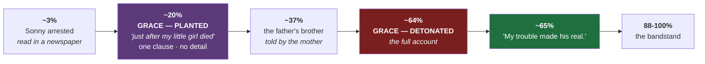

# 📋 STORY SHEET — *Sonny's Blues*

**James Baldwin, 1957** · scored **44 / 45** · instrument: [[01 The Six — Analysis Instrument]]

> [!important] This is a benchmark, not a data point
> The other sheets measure **stories that placed**. This one measures a story that is simply better than the competition, to establish where the ceiling is. **Do not average it into the board.**

---

## ✅ VALIDATION — read in full

Full text read. Positions below are **measured against the source pagination** (33 pages) and are exact to the page.

**Rhythm figures are reading-based estimates, not script output** — the story was not written to disk. Direction is unambiguous and reported as such.

> [!warning] Two corrections to the first pass
> The earlier sheet was written from memory before the full text was available. Two things were wrong, and one of them was the most important finding in the story. Both are fixed below.

---

## 🔓 REVELATION

### 1 · Grace ⭐ — **the correction, and the most important finding on this sheet**

The first pass said Grace appears at ~40% and gets no ceremony. **Both halves were wrong.**

What Baldwin actually does:

- **~20%** — the narrator says, in passing, that he finally wrote to Sonny *"just after my little girl died."* **One clause. No name given, no detail, no weight.** Sonny's returning letter mentions *"little Gracie"* and the reader files it as background.
- **The story then runs for 44% of its length without returning to it.**
- **~64%** — Baldwin comes back and gives the full account: the fever that dropped, the fall in the living room, the silence that frightened Isabel more than a scream would have, the child unable to draw breath. And Isabel still waking from it years later.

**That is the late reframe, executed at scale, by the best writer on the board.** A fact planted flat and early, left to be misfiled, detonated after nearly half a story.

It independently validates [[05 The Late Reframe]] — and it shows **The Beat has the proportions wrong**: the plant and the detonation are 44 points apart in Baldwin, 16 points apart in ours.

### 2 · Why the father was the way he was — **~37%**

The mother tells it after the father's death: the father's brother, drunk and whistling with a guitar on his shoulder, run down for sport by a car of white men who never stopped. She ends it with an instruction rather than a moral — *hold on to your brother, and let him know you're there.*

The narrator promises. **Two days later he marries and leaves, and forgets the promise until her funeral.** Baldwin gives you the instruction and then spends the rest of the story on the failure to keep it.

### 3 · What Sonny's suffering actually is — **~80%**

Held until the conversation after the revival meeting. Not the heroin. That there is a storm inside that cannot be talked and cannot be loved out, and that when you finally try to play it, nobody is listening. His conclusion is an instruction too: *you got to find a way to listen.*

**Never released:** whether Sonny stays clean. Sonny himself forecloses it — *it can come again*, said twice — and Baldwin refuses to answer.

### The hinge — five words at ~65%

> *My trouble made his real.*

The controlling idea in miniature, and the exact point at which the narrator becomes able to hear his brother. It sits immediately after the Grace detonation and it is why the detonation is placed where it is.

---

## 🗣 EVALUATION

**Very high — the highest on the board, confirmed by reading.**

Whole paragraphs are pure narratorial reflection with no scene at all: the passage on the old folks in the darkening living room and what the child knows; the passage on the housing project; and the opening of the final section — *not many people ever really hear music* — which is a page of essay dropped into the climax.

> [!success] The commentary question is closed
> | Story | Evaluation | Quality |
> | --- | --- | --- |
> | **Baldwin** | **highest** | **44/45** |
> | Uwazuruike | 11.9/1k | placed · 33/45 |
> | Giorgis | 8.1/1k | placed · 33/45 |
> | **Chantal** | **lowest** | 40/45 |
>
> The correlation runs **opposite** to Barrett's worry. Fourth confirmation. **Stop cutting commentary.**

---

## 📏 RHYTHM — the metric retires

**Baldwin runs long.** Clause-piling, comma-spliced, paragraph-length sentences, with short ones used sparingly as punctuation — *And myself.* · *It did.* · *But I knew what he meant.* · *My trouble made his real.*

Set against the board:

| Story | Avg sentence | %&lt;10w | Quality |
| --- | --: | --: | --- |
| Uwazuruike | **11.0** | 49% | placed |
| Chantal D3 | 14.7 | 48% | ours |
| Giorgis | 14.9 | **30%** | placed |
| **Baldwin** | **longest by far** | **lowest** | **best** |

> [!danger] There is no winning rhythm
> Three good stories occupy three completely different rhythm profiles. Uwazuruike places with 11.0. Baldwin wins everything with sentences several times that length.
> **This metric can tell you when you are an outlier. It cannot tell you what to aim for.** Chantal's 48% is fine. So was 57%. The two passes spent chasing this number bought less than the mother detonation bought in one paragraph.

---

## ⚖️ FORGIVENESS — 44 / 45

| # | Axis | | | # | Axis | |
| :--: | --- | :--: | --- | :--: | --- | :--: |
| 1 | Opening authority | **5** | | 6 | **Structural economy** | **4** |
| 2 | Prose control | **5** | | 7 | Controlling idea | **5** |
| 3 | Character interiority | **5** | | 8 | Resonant close | **5** |
| 4 | Scene turn | **5** | | 9 | Something to say | **5** |
| 5 | The gap | **5** | | | **TOTAL** | **44** |

**Structural economy — 4, and this is the second correction.** The first pass called the middle "baggy." Having read it: the India conversation, the argument about Louis Armstrong, the piano at Isabel's, the letters from Isabel — these are longer than a modern editor would allow, and the story would survive losing some. **But nothing in it is inert**, and the sprawl is doing characterisation work. It is a 4 by a hair, not by a mile.

> [!quote] What is forgiven at this level
> **Length, and a middle third that moves slowly** — in exchange for a narrator who cannot stop thinking, a plant-and-detonation across half the story, and a final scene that pays every debt at once.
> **Baggy is survivable. Flat is not.**

### The pattern across the whole board

| Story | Loses on | Wins on |
| --- | --- | --- |
| Baldwin | economy | **voice · interiority · close** |
| Uwazuruike | opening · prose | **voice · reversal** |
| Giorgis | prose · interiority | design · revelation |
| **Chantal** | **prose control · controlling idea** | **architecture** |

**Every story measured loses on structure and survives it. Chantal is the inverse.** These panels forgive architecture and do not forgive voice — and Chantal is strongest in the forgiven column.

---

## 🔧 COMPETENCE — **Y (qualified)** · hypothesis 1 for 3

The narrator teaches algebra and is **never once shown teaching it** — same fault as Giorgis's engineer and Uwazuruike's law student.

But the final section contains **real, specific knowledge of how a band works**: Creole holding the players on a short rein and then letting the reins out; the bass answering the drums and the drums answering back; Creole waiting for Sonny to do the thing on the keys that would tell him Sonny was in the water; and Creole stepping back at the end so that Sonny speaks alone. That is somebody who has watched musicians work.

> [!important] The structural lesson for Ilunga
> **Baldwin gives the competence to the man being watched, not to the man narrating.**
> The narrator's job is to fail to understand for thirty pages and then understand in one scene. **The distance between the man who can play and the man who can only listen is the entire engine.**
> Ilunga currently holds the drum *and* the grief. That is two jobs Baldwin deliberately split.

---

## → THE FIVE THINGS THIS CHANGES IN [[The Beat of My Hurt]]

### 1 · The plant-to-detonation gap is far too short

Baldwin: plant at **20%**, detonate at **64%** — **44 points apart.**
The Beat: plant at ~4%, detonate at 69% — but the *father* is only mentioned once before the reveal, so the reader has nothing filed to be wrong about.

**Fix:** mention the father's funeral flatly and early, with no weight, and let it sit.

### 2 · Write the performance long

Baldwin gives the final set **pages 29–33 — roughly 12% of the story.**
Ilunga playing the tenth beat gets **one paragraph.** This is the single biggest fixable weakness in the draft.

### 3 · Give the competence to the watched

Consider making the **uncle** the one who plays the tenth beat, with Ilunga listening — the way the narrator listens to Sonny. That would restore the distance Baldwin built the story on.

### 4 · The hinge sentence

*My trouble made his real.* Five words, at 65%, and the whole story turns on them. The Beat has no equivalent — no single sentence where the professional becomes the son.

### 5 · Stop chasing the rhythm number

Retired. See above.

---

## Access

- [SJSU PDF](https://www.sjsu.edu/faculty/wooda/2B-HUM/Readings/Baldwin-Sonnys-Blues.pdf) — scan, **no text layer**
- [Le Moyne — text and audio](https://resources.library.lemoyne.edu/common-reading/baldwin)
- [HCC Learning Web](https://learning.hccs.edu/faculty/selena.anderson/engl1302/readings/sonnys-blues-by-james-baldwin/view) — HTML

## Related

- [[05 The Late Reframe]] — independently validated here, at scale
- [[02 Comparison Board]] · [[The Beat of My Hurt]] · [[The Beat of My Hurt (Draft 2 — Full Apparatus)]]
