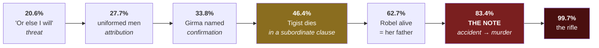
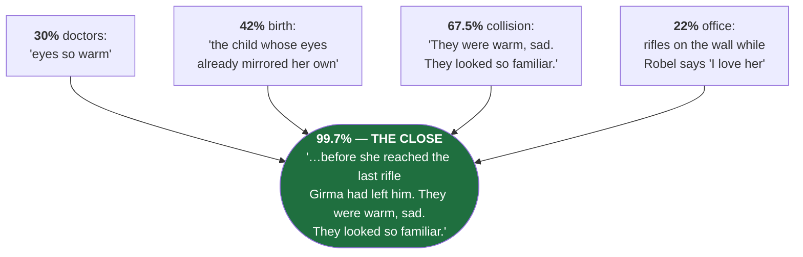

# 📋 STORY SHEET — *A Double-Edged Inheritance*

**Hannah Giorgis** · 5,179 words · scored **33 / 45** · instrument: [[01 The Six — Analysis Instrument]]

---

## ✅ VALIDATION

**5,179 words · 348 sentences.** Text begins at the first sentence and ends at the last — **complete**. Axes 1 and 8 scoreable.

> [!warning] Prize unidentified — and it cannot be Commonwealth
> 5,179 words is **outside the Commonwealth gate of 2,000–5,000**. Whatever this placed in, it was not that. Until the prize is named, the FORGIVENESS section has no anchor: *"what the prize forgave"* requires knowing the prize.

> [!bug] This story cost us a full pass
> The first run was done on a **truncated paste** that cut off mid-clause at *"shopkeepers and tourists alike pausing"*. That pass scored resonant close **1** and concluded *"the prize forgave an unfinished story."* Both wrong — the transmission was unfinished, not the story. VALIDATION was added to the instrument as a direct result.

---

## 🔓 REVELATION

**1 · The beating was ordered by Girma.** A soft three-stage release — foreshadowed at **20.6%** (*"Or else I will."*), attributed at **27.7%** (*"not to the swarm of uniformed men who'd descended upon her"*), confirmed at **33.8%**. By the time it lands it is confirmation, not shock.

**2 · Robel is alive, and is Meskerem's father.** Released at **62.7%** by a name and a rank — *"General Robel Girma had not been to Shiro Meda in years."* The best-engineered reveal in the story: delivered four words into a sentence that reads as scene-setting.

**3 · Tigist's car accident was not an accident.** ⭐ **Never stated.** Her death arrives at **46.4%** inside a subordinate clause of a sentence about somebody else — *"why God had let her mother die alone in a car accident while she had been away taking classes."* It reads as random. Then at **83.4%** the note surfaces:

> WE WILL FIND HER THERE. WE WILL FINISH WHAT WE STARTED.

The reader retroactively converts an accident into a murder across **37% of the story**, and the text never once says so.

What stands in for the unreleased fact is the parenthesis at **50.9%** — *"after her husband had died mysteriously (in the war?)"* — a daughter presenting her family history to a lecture hall and sourcing its one load-bearing lie to a guess.

---

## 🗣 EVALUATION

**~42 sentences · 8.1 per 1,000 words.** *(Judgement-dependent, ±15%. Excludes dialogue, description, and thoughts tagged to a character.)*

> *"Powerful men were dangerous, their lust for dominion more potent than any love they might claim to feel for a woman."*

An aphorism with no owner — the story stating its thesis in the eternal present, before dramatising it.

> *"Meskerem was a brilliant, preternaturally insightful child."*

Asserts a quality never shown in action. Her one demonstrated cognitive act is a presentation built on a fact she has wrong.

> *"He knew she would be enraged at the sight of him. He knew she had a right to be."*

A moral ruling handed down by the narrator through the mouth of the person being ruled on. It relieves the reader of deciding.

---

## ⚖️ FORGIVENESS — 33 / 45

| # | Axis | | | # | Axis | |
| :--: | --- | :--: | --- | :--: | --- | :--: |
| 1 | Opening authority | **3** | | 6 | Structural economy | **3** |
| 2 | Prose control | **3** | | 7 | Controlling idea | **4** |
| 3 | Character interiority | **3** | | 8 | **Resonant close** | **5** |
| 4 | Scene turn | **4** | | 9 | Something to say | **4** |
| 5 | The gap | **4** | | | **TOTAL** | **33** |

*Four-way tie at the bottom. The two that matter:*

**Character interiority — 3.** Characters are installed rather than revealed: *sharp and poetic*, *quiet and pious*, *brilliant, preternaturally insightful*. Four sections open by stopping the story to file a biographical entry. The two genuine interiority moments — the *(in the war?)* parenthesis and *"He knew. He had to know."* — show what the other 90% could have been.

**Prose control — 3.** Register lurches between the strained (*"makes unseasoned mincemeat of its remains"*, *"his resolve ossified"*, *"their affections waned with all the grace of poison"*) and the genuinely good (*"half teeth and half arrogance"*). Participial openers stack: *Breathless and full of…*, *His face a gnarled mess of…*, *Wiping tears from his face with…*

> [!quote] What was forgiven
> An **over-length, expositionally baggy manuscript with a narrator who states her themes before earning them** — forgiven in exchange for a **superb architecture of revelation** and an ending that pays four separate plants at once.
> **The prize rewarded design, not sentences.**

### Why the close is a 5

Same office. Same desk. Same rifles. **The weapon is the grandfather's.** The title detonates: she inherits her mother's eyes *and* her grandfather's violence.

---

## 🔧 COMPETENCE — **N**

Native cultural fluency, deployed accurately — Amist Kilo, Meskel Adebabay, Tikur Anbessa, *tsom*, *netela*, *kremt*, Genna, and the calendar fact that makes 11 September **Meskerem 1**. But that is **setting, not procedure**. It tells you where you are, never how anything is done.

Every professional domain named goes undemonstrated:

| Character | Named as | Ever shown doing it? |
| --- | --- | :--: |
| Tigist | engineering prodigy | ❌ |
| Robel | final-year law student | ❌ |
| Almaz | literature professor | ❌ *(shown holding Baldwin)* |
| Girma | army's most respected general | ❌ *(rendered as furniture)* |

**Nobody in this story is ever shown at work.** The nearest miss is the gabi — that a new one smells strange and dirty, that a household washes them each season, that softness is the measure and softness means home. One paragraph, load-bearing twice, and the only thing the narrator knows how to do.

---

## → What this changed

- **[[02 Comparison Board|Rhythm]]:** 30% vs Chantal's 57%. Exercise 1 confirmed as the priority; the ~50% target may be too soft.
- **Evaluation:** 8.1/1k vs Chantal's much lower count. **Stop cutting commentary** — the full stops are the problem, not the aphorisms.
- **Competence:** first result against the hypothesis. 0 for 1.
- **Technique to steal:** the late reframe. Is there a fact in Chantal that could be planted innocuous and detonated at ~85%? Candidate: the mother.
