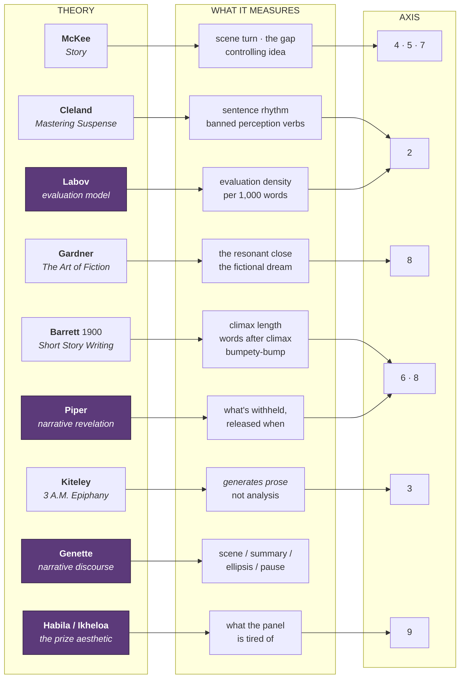
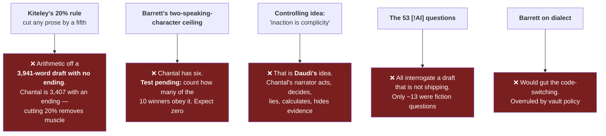
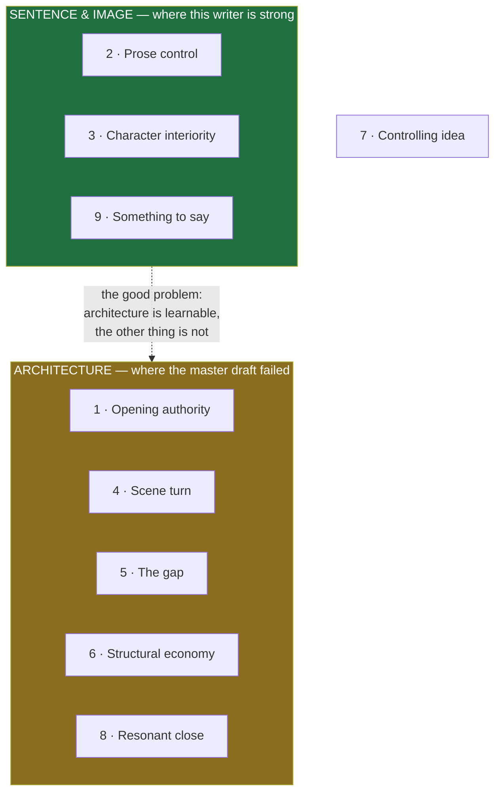
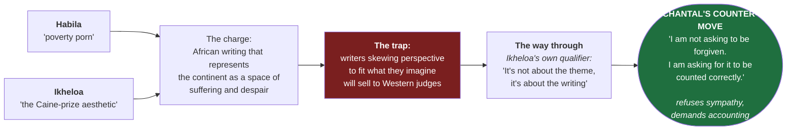

# ⚖️ CRAFT LAWS — REFERENCE CARD

> [!abstract] Every rule currently acting on Chantal
> Ten bodies of theory, four of them new to this vault. Some are **live**. Some have been **retired** — and knowing which is retired matters more than adding another one.

---

## The map

---

## 🟢 LIVE — these govern current work

| Law | The rule, stated | Chantal |
| --- | --- | --- |
| **Cleland — the 20-word rule** | Average sentence under 20 words. Long (30–70w) = mood. Short (4–10w) = action, shock | 12.8 avg ✅ |
| **Barrett — bumpety-bump** | Excess short sentences read as stammer, not style | **57% under 10w** 🔴 |
| **Barrett — climax and conclusion** | The climax proper runs about six words; the ending sits within a paragraph of it | ~45 words after ✅ |
| **Barrett — all destinies settled** | The climax must decide the fate of every character and scheme | Morisho paid off ✅ |
| **Gardner — the resonant close** | Every closing image must drag an earlier one behind it, planted twice | 4 echoes converge ✅ |
| **McKee — the Gap** | Character expects X, gets Y. Bigger gap = harder-working scene | back room ✅ |
| **McKee — every scene turns** | Someone's situation changes, or cut the scene | Mihogoni weakest 🟡 |
| **Labov — evaluation** | Narratorial judgement, counted per 1,000 words | needs re-count 🟡 |
| **Piper — revelation** | *Given what came before, how surprising is this passage?* Measured by position | pregnancy @72.4% ✅ |
| **Cleland — banned words** | Cut *saw, looked, heard, felt, noticed, realized, understood, knew* | 22 instances 🟡 |
| **The no-italics rule** | Swahili/French/Lingala never italicised — native register, not foreign flourish | ✅ absolute |

---

## 🔴 RETIRED — do not act on these

---

## 🎯 The Nine Axes

**Reading the total:** below 27 → structural work · 27–35 → refinement · **above 36 → competing**. A single **1** anywhere caps the story regardless of total, because judges eliminate on faults, not averages.

**Chantal: 40/45.** No axis below 4.

---

## 🕵️ The fingerprint rules

*Not from any book — measured directly in this draft. These are the habits that read as machine-made, and each is a prose weakness first.*

| Tell | In Chantal | Fix |
| --- | --- | --- |
| **The "the way you—" simile frame** | **10 instances** in 3,407 words, two in one sentence | cut to 3 |
| **The balanced antithesis** — *"Not X. Y."* | 5 (was ~20 before the Barrett pass) | keep the best 2 |
| **The self-summarising paragraph** | present | let paragraphs stop mid-gesture |
| **Total load-bearing-ness** | every detail pays off | **add 3–4 inert details that mean nothing** |
| **Vocabulary slightly too apt** | no wrong words anywhere | let one near-miss word stand |

> [!note] The deep defence
> A machine supplies what it has read. It cannot supply what you have **done**. The real denominations in that envelope, the actual arithmetic of that back room, what the station smells like at 2pm — nobody can sniff a thing that could only have been written by someone who was there and can count.

---

## 🌍 The prize aesthetic — competitive intelligence

A Tanzanian writer submitting a story about a sexually exploited child to a British-administered prize is entering this argument whether or not they know it exists. **Know it.** And hold the no-explanation line absolutely — *mia tano mia tano* stands, *shemeji* stands, no glossary, no italics.

---

## Sources

- [[Story structure by robert mackee.md|McKee]] · [[Mastering Suspense by Jane Cleland|Cleland]] · [[The Art of Fiction by John Gardner|Gardner]] · [[Short Story Writing by Charles Raymond Barrett|Barrett]] · [[The 3 AM Epiphany by Brian Kiteley|Kiteley]] · [[Learning Curve|Learning Curve]]
- **Piper, Xu & Kolaczyk**, *Modeling Narrative Revelation* — [paper](https://ceur-ws.org/Vol-3558/paper6166.pdf)
- **Labov & Waletzky**, the evaluation model — oral first-person narrative structure
- **Genette**, *Narrative Discourse* — order, duration, frequency, focalization *(held in reserve)*
- The prize-aesthetic debate — [Brittle Paper](https://brittlepaper.com/2013/12/caine-prize-poverty-pornstars-bulawayo-takes-swipe-helon-habila/)
