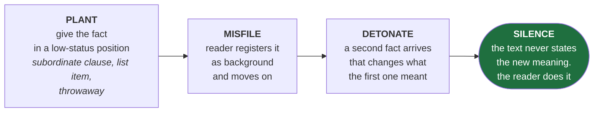
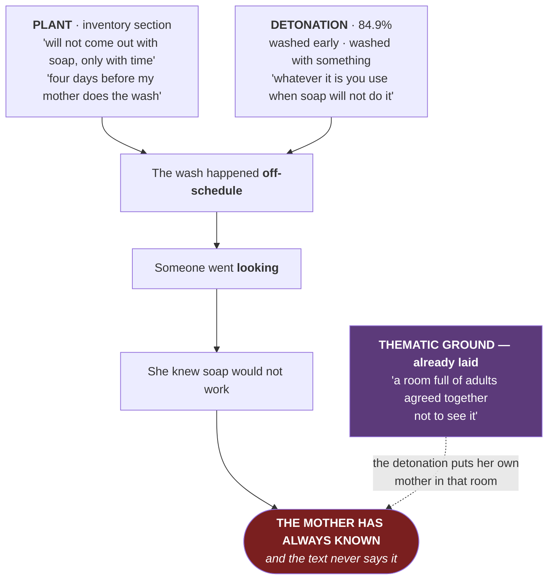

# 🔁 THE LATE REFRAME

> [!abstract] Stolen from [[Giorgis — A Double-Edged Inheritance]], implemented in Chantal 2026-07-27
> Not withholding. **Withholding** tells the reader a hole exists. **The late reframe** hands them the fact, lets them file it wrong, and much later makes them wrong — without ever stating the correction.

---

## The mechanism

**Giorgis's version.** Tigist dies at **46.4%**, inside a subordinate clause of a sentence about somebody else — *"why God had let her mother die alone in a car accident while she had been away taking classes."* Random. Filed. Then at **83.4%** a paper falls out of a Baldwin novel: *WE WILL FIND HER THERE. WE WILL FINISH WHAT WE STARTED.* An accident becomes a murder across 37% of the story, and **no sentence anywhere says so.**

---

## Why Chantal needed one

Because the narrator is too good.

She performs every reframe herself, on the page, in real time — *"He meant it as a warning. I heard it as a price list."* · *"It was not shame. It was arithmetic."* · *"I tagged it blessed and forty-one people liked it and none of them asked me anything."*

That is exactly why **axis 3 scores 5**. It is also why the draft had no detonation anywhere. **The strength and the absence were the same trait.**

> [!important] The constraint that follows
> Any reframe must concern something **she cannot see** — otherwise she narrates it and it stops being a reframe.
> In a story told entirely from inside her head, exactly one character has opaque interiority: **her mother.**

---

## What was implemented

### The plant — already in the draft, untouched

> *"A perfume. Shalis by Remy Marquis. Not mine. It gets into the weave of a khanga and **will not come out with soap, only with time**, so I learned to leave certain clothes at the bottom of the basket for four days before my mother does the wash."*

Reads as competence. One more item in a list of things she is good at.

### The detonation — inserted at 84.9%

Between the thin envelope and *"School on the Monday"*:

> The house was empty when I got home. My clothes were folded on the end of the bed, all of them, including the two from the bottom of the basket that still had four days to go. Somebody had washed them with soap and then with something after the soap — vinegar, or paraffin, **whatever it is you use when soap will not do it.**
>
> I put them in the drawer. Then I stood in the doorway of the kitchen for a while, and my mother was not in it, and I went to bed.

### Why it works

**She registers the fact and does not draw the conclusion.** She goes to the kitchen doorway to find her mother, and never says that is what she is doing. The reader gets there first — the only place in 3,500 words where that happens.

And it retroactively converts the whole inventory section from *a display of cunning* into *a record of a mother watching a child hide, and letting her.*

---

## Cost

| | Before | After |
| --- | --: | --: |
| Words | 3,407 | **3,502** *(+95)* |
| Headroom under 5,000 | 1,593 | **1,498** |
| Sentences | 267 | 272 |
| Under 10 words | 57% | 57% *(insert runs 40%)* |
| Detonation position | — | **84.9%** |

---

## ⚠️ The standing tension

Two turns before this was proposed, the campaign recorded that **everything in this draft pays off**, and that total load-bearing-ness is itself a machine-tell — the fix being to *put the inert back*. This adds another perfect payoff.

> [!warning] The resolution — treat as binding
> **This is the one device.** It earns its place because it is the only payoff the narrator does not control: every other echo is her showing you how clever she is, and this one is the story being cleverer than her.
> **It is therefore an argument for FEWER engineered echoes elsewhere, not more.** If a future pass wants to add a second reframe, cut this one or cut that one. Not both.
> See the fingerprint rules in [[04 Craft Laws — Reference Card]] — the three or four deliberately inert details are still owed.

## Related

- [[Chantal — Prize Plan]] — Exercise 3 now feeds this
- [[02 Comparison Board]] — revelation-position bars for both stories
- [[Giorgis — A Double-Edged Inheritance]] — where the technique came from
