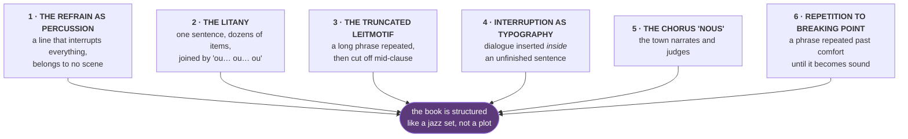

# 🎷 CONGOLESE RHYTHM — THE MUJILA STUDY

> [!abstract] What this is
> A technique breakdown of *Tram 83* — the most-travelled Congolese novel of the last decade — aimed at one question: **what can Kalemie use, and what would destroy it?**
> Read alongside [[04 Craft Laws — Reference Card]] (the prize-aesthetic section) and [[02 Comparison Board]].

> [!warning] The framing that matters most
> Mujila is **maximalist, choral, polyphonic, 200+ pages, set in Lubumbashi/Katanga, written in French.**
> Chantal is **3,569 words, single-voice, restrained, set in Kalemie/Tanganyika, Swahili-inflected English.**
> **Most of what makes Tram 83 work would demolish Chantal.** The value here is selective theft, not immersion.

---

## THE RHYTHM ENGINE — six devices

### 1 · The refrain as percussion

Three lines recur across the whole book, cutting into scenes with no transition and belonging to no speaker in particular:

- ***"Vous avez l'heure ?"*** — the solicitation line, dozens of times
- ***"Pourboire !"*** — the waitress demanding her tip
- ***"Les préliminaires…"*** — endless variations on foreplay

They are not dialogue. **They are a rhythm section.** They land mid-paragraph, mid-argument, mid-exposition, and the prose simply carries on around them. The effect is that the bar never stops making noise while the plot happens.

### 2 · The litany

A single sentence listing every kind of person in the bar — *musicians by accident, third-age prostitutes, conjurers, revival pastors, defrocked lawyers…* — running for most of a page on a chain of **"ou… ou… ou."** Also used for Requiem's nicknames (*alias… alias… alias…*) and for the city at night.

**Accumulation replaces description.** You never see the room; you receive an inventory of it.

### 3 · The truncated leitmotif ⭐

The single best device in the book, and the most stealable.

A long formal phrase about the station — the unfinished metal structure, shells, rails, locomotives, Stanley's railway line — is stated in full early on. Then it returns **again and again, and is progressively cut off**: sometimes to half its length, sometimes to just *"la gare dont la construction métallique…"* with the sentence simply abandoned.

**The reader completes it.** By the fifth truncation the fragment carries the whole weight of the original. The novel opens with it and closes on it, restored to full length.

### 4 · Interruption as typography

In the chapter on the Vampires quarter, a paragraph of colonial history is **physically interrupted** by lines of bar dialogue dropped between its clauses — then the sentence resumes and finishes as if nothing happened. The history and the pick-up lines are on the page simultaneously.

### 5 · The chorus "nous"

Periodically the narration stops being third-person and becomes a **collective first person** — the town speaking, and always about Lucien: *he annoyed us · he made us jealous · what shame we felt.* The community is a character with opinions, and it disapproves of the writer.

### 6 · Repetition to breaking point

*"The dogs kept snickering"* repeated more than a dozen times during the arrest. *"What a voice"* repeated past all reason during the diva's performance. The word *lugubre* repeated dozens of times in a single sentence.

**Deliberate excess as crescendo.** It stops being meaning and becomes sound.

---

## WHAT TRANSFERS TO CHANTAL

| Device | Verdict | How |
| --- | :--: | --- |
| **The truncated leitmotif** | ✅ **Test it** | Chantal's four ships, or the four days at the bottom of the basket. State it fully once, return to it twice, truncate the second return |
| **The refrain as percussion** | 🟡 **One only** | *mia tano mia tano* is used **once**. Mujila would use it eight times. Try three placements — the dala dala, the market, and the walk home at the end |
| **Taxonomy** | 🟡 **One more** | Mujila age-grades the bar women into three named ranks. Chantal has *ghost kids* and nothing else. One more piece of naming would deepen the world at no word cost |
| **The chorus "nous"** | ❌ | Chantal is sealed inside one head, and that is why axis 3 scores 5. A chorus would break it |
| **The litany** | ❌ | Would blow the word count and the register in one move |
| **Repetition to breaking point** | ❌ | Requires length to earn. At 3,569 words it reads as a tic, not a crescendo |
| **The body inventory of women** | 🚫 **Never** | See below |

> [!danger] The device you must not steal
> Mujila catalogues women's bodies relentlessly — breasts sorted by fruit, buttocks by shape, girls priced and ranked. **This is precisely what [[04 Craft Laws — Reference Card|Ikheloa attacked as misogynist poverty porn]]**, and the *"Vous avez l'heure ?"* refrain — technically brilliant — is the exact mechanism of the charge, because it reduces every woman in the book to one line.
> **Chantal's entire achievement is the inverse:** the girl who would be a *caneton* in Mujila's taxonomy is the one holding the pen. Do not import the technique that would undo that.

---

## STREET VOCABULARY — and the problem in your draft

### What Mujila is actually using

This is **Katanga/Lubumbashi French**, not Kalemie Swahili. Useful, but not yours:

| Term | Meaning | Real or coined |
| --- | --- | --- |
| **creuseurs** | artisanal miners, "diggers" | ✅ real DRC usage |
| **délestage** | rolling power cuts | ✅ **real and universal in DRC** |
| **Article 15** | the unwritten constitutional article: *fend for yourself* | ✅ **real, famous, deeply Congolese** |
| **la débrouille** | making do, hustling | ✅ real |
| **sapeurs** | the SAPE dandies | ✅ real |
| **atalaku** | the hype-man/animator in Congolese rumba | ✅ real |
| **mabanga** | paid shout-outs inside a song | ✅ real |
| **ndombolo · kotazo · coupé-décalé** | dance styles | ✅ real |
| **guimbarde · gargote** | jalopy · cheap eatery | ✅ standard French |
| **canetons · biscottes · têtes brûlées · affreux** | child prostitutes · boy labourers · street gangs · militia | 🟡 largely **his own coinages** for a fictional city-state |
| **Deuxième République** | the Mobutu era | ✅ real |

**Two are worth stealing outright: *Article 15* and *délestage*.** Both are instantly, unmistakably Congolese, both are single words, and both would pass Barrett's local-colour test — no other lake town has them.

### 🔴 The problem in Chantal

Your draft runs on **East African** street vocabulary in an **eastern Congolese** setting:

| In your draft | Where it's actually from | Verdict |
| --- | --- | --- |
| **dala dala** | Tanzania — specifically the minibus | 🔴 check |
| **boda boda** | Kenya/Uganda/Tanzania | 🔴 check — DRC says **moto**, **taxi-moto**, or **wewa** |
| **mia tano mia tano** | Swahili — fine | ✅ |
| **shemeji** | Swahili — fine | ✅ |
| **dagaa** | Swahili — fine | ✅ |

Tanganyika province is genuinely Swahili-speaking, French is official, and Kalemie sits directly across the lake from Kigoma with heavy cross-lake traffic — **so the borrowing is defensible.** But right now it looks like an accident, and a judge or reader who knows the region may read it as **Kigoma leaking into Kalemie.**

> [!done] DECIDED AND IMPLEMENTED — 2026-07-28
> **Terms kept. Cross-lake traffic made explicit** in one sentence at **6.4%**, immediately after the Mihogoni paragraph:
>
> *The boats come over from Kigoma with dagaa and secondhand words, and we keep both, so half of what gets shouted on this road is Tanzanian and nobody here has ever thought to mention it.*
>
> Converts a possible error into deliberate geography, and makes the border-as-suggestion idea in the opening pay twice. Costs 33 words. **The rejected alternative** was swapping *boda boda → moto* and *dala dala → taxi-bus*, which would have moved the story onto the Congolese side of the water but thrown away the fact that this town is a crossing.

---

## The two sentences worth remembering

Mujila's best formal move is his simplest: **a phrase that returns shorter each time until the fragment carries the whole**. His worst is the one everybody quotes.

**Steal the first. Leave the second.**

## Related

- [[04 Craft Laws — Reference Card]] — the Habila/Ikheloa prize-aesthetic debate
- [[05 The Late Reframe]] — the one engineered device already committed to
- [[Chantal — Prize Plan]] — where the *moto/dala dala* decision gets recorded
