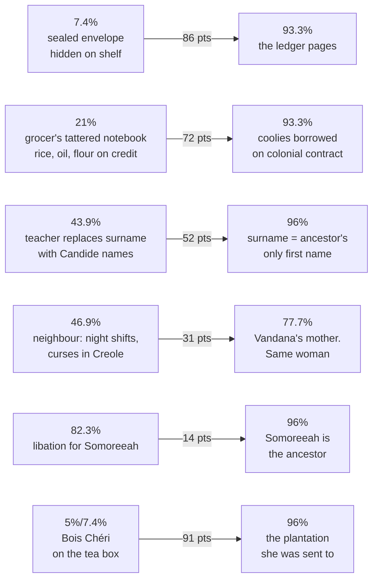

 
# ⊹ MARGINALIA · *Dite*

> [!warning] What this file is and is not
> **The story text is not here.** These are the marks that go *beside* it. Print `dite.docx`, sit this next to it, and transfer the marks by hand — the transferring is the exercise.
>
> Percentages are computed from real character offsets across 25,504 characters, 57 paragraphs, ~4,631 words. `P12 · 21%` means paragraph 12 ends 21% of the way in. Annotations are Claude's; the prose is the author's. Same handling as its sibling [[Dite — ANNOTATED]] — private study markup, don't push.

> [!danger] Two corrections to [[Dite — ANNOTATED]]
> **1 · `tall` appears 12 times, not 5.** The old count is wrong by more than double, and the miss matters — the motif is the story's whole argument. Full inventory below.
> **2 · The sealed envelope does close.** The old file says it "does not return for the entire story." It returns at 93.3% as the ledger pages. Plant at 7.4%, payoff at 93.3% — an 86-point span, the longest in the story.

---

## The marks

```
||   crucial — do not skim            ▢   word to track (motif instance)
|    important                        ※   motif recurrence, counted
→    plants forward  (to %)           ←   pays off  (from %)
⊗    turn / hinge                     ∴   this is the argument
!    shock                            ?   query — verify on reread
✓    felt something                   ⌐   register shift
```

---

# ⌐ THE FOUR EPIGRAPHS — read these four alone, in order, first

They are the story's spine and no prose ever explains them. **This is the ladder:**

| | % | Register | Whose mouth |
| :-: | :-- | --- | --- |
| **1** | 16.2% | `deksi` · cardamom · lemongrass · milk powder | **Family recipe.** Creole kitchen, imperative, no reader assumed |
| **2** | 47.5% | tulsi · ginger · *"for the sake of your unborn child"* | **Folk-ritual.** Still hers, but now superstition, addressed to a woman |
| **3** | 57.3% | sachet · *"cucumber sandwich or scone"* | ⌐ **English genteel.** The recipe has been colonised. Nothing is stated |
| **4** | 79% | *"authentic vista"* · *"colonial teahouse"* · Gold Label | ⌐⌐ **Tourist brochure.** Her grandmother is now scenery — *"local women picking tea"* |

∴ **Four fragments, no commentary, and the entire colonial argument is made.** The woman picking tea in fragment 4 is Dadi, whom we meet at 84.7%. The reader assembles that; the story never risks saying it.

> [!tip] For Chantal
> This is what a **5 on axis 7** looks like — *never stated, impossible to miss.* Chantal is capped at 3 because its two best lines state the controlling idea. This story refuses to state it four times and wins the point.

---

# ※ MOTIF 1 · THE THROAT — 6 instances, all six marked

The count is correct in the old file. Here is where they sit.

| # | P · % | Mark | What the throat is doing |
| :-: | :-- | :-: | --- |
| 1 | P8 · 15.5% | `▢ →` | Tea **burns** it. The throat is introduced as a site of pain, not speech |
| 2 | P20 · 40.6% | `▢ \|\|` | Holding in cries *"until my throat hurts more than the welts"* — pain chosen over sound |
| 3 | P21 · 43.9% | `▢ !` | *"feeling no pain at all except the strange one in my throat"* — the body has relocated all pain to the voice |
| 4 | P35 · 68.6% | `▢ \|\|` | *"my aching throat"* turned to the wall during sex. Silence is now erotic refusal |
| 5 | P37 · 73.5% | `▢ ⊗` | The knot **alchemises** Creole into English. ⊗ **The throat is a translation engine** |
| 6 | P53 · 96% | `▢ ← ∴` | The knot returns as the eyes hit *"Height: 3 feet 2 inches"* |

∴ **Never once explained.** Six placements across thirty years and a colonial archive, and the story never writes the sentence *her silence was inherited.* That sentence is the reader's to write.

> [!note] The technique to steal
> A motif that is **a body part, not an object.** It can't be lost, given away or described — it can only recur. Chantal's counting is a *trait* (she does it); the throat is a *place* (it is done to her). Day 3's finding lives here.

---

# ※ MOTIF 2 · TALL — 12 instances. THIS IS THE STORY

Every one, counted from source. Mark all twelve.

| # | P · % | Mark | Instance |
| :-: | :-- | :-: | --- |
| 1 | P20 · 40.6% | `▢` | *stand tall and silent* — under the cane |
| 2 | P21 · 43.9% | `▢` | *stand tall and silent* — future tense, secondary school |
| 3 | P26 · 52.2% | `▢ ?` | the **tall mama rock** / small baby rock for grinding spice ← *different sense, same word. Mark it anyway — mother and daughter as two stones* |
| 4 | P28 · 54.3% | `▢` | Mama in the doorway, *standing tall and silent* — inherited posture, seen before birth |
| 5 | P29 · 56.8% | `▢` | *"her son would be tall"* — the folk reason for the brew |
| 6 | P29 · 56.8% | `▢ !` | *"the tallest woman of the family"* — the brew worked, on a daughter |
| 7 | P36 · 69.9% | `▢` | *I stretch tall, silent* — coming, wordless, under Nigel |
| 8 | P48 · 84.7% | `▢` | *her strong, tall frame* — riding in Dadi's tea basket |
| 9 | P50 · 88.2% | `▢ \|\|` | six-foot powerhouse *"now barely three feet tall, the height of a child"* |
| 10 | P53 · 96% | `▢ ⊗ ∴` | **`Height: 3 feet 2 inches`** — the ledger column |
| 11 | P53 · 96% | `▢ ∴` | *"She is tall, taller even than him"* — 3 ft 5 in. A five-year-old |
| 12 | P57 · 99.8% | `▢ ✓` | *Standing tall over the bushes* — final sentence |

## ∴ What the twelve do together

⊗ **The hinge is #10.** For 96% of the story, *tall* is dignity — the posture you hold while being beaten, the thing your mother's brew was for, the compliment. Then the ledger arrives and **height is revealed as a column in a shipping manifest.** Every prior instance re-reads at once.

The grandmother is bent to three feet by seventy years of picking. The ancestor arrived measured at three feet two. **Colonialism is written in the story as a height measurement**, and the word for pride and the word for cargo are the same word.

> [!danger] This is the single most instructive move in the story
> It is the *reader-arrives-first* engine at scale — not one moment, a whole vocabulary. Chantal has one instance (the folded clothes, 84.9%) and scores 3 on that axis. This has twelve and scores 5. **The gap is not talent. It is repetition with delayed detonation.**

---

# → LONG-RANGE PLANTS — every one, with its span



| → Plant | ← Payoff | Span | Mark |
| --- | --- | :-: | :-: |
| **P5 · 7.4%** sealed envelope hidden behind the tins | **P52 · 93.3%** the two pages from Dadi | **86** | `\|\| →` |
| **P12 · 21%** grocer's tattered notebook — *rice, oil, flour* on credit | **P52 · 93.3%** *"instead of oil, rice, and flour… the names of coolies borrowed on colonial contract"* | **72** | `\|\| ∴` |
| **P5 · 7.4%** box labelled *Bois Chéri* | **P53 · 96%** the plantation Somoreeah was sent to | **91** | `\|\|` |
| **P21 · 43.9%** teacher swaps her surname for Candide names | **P53 · 96%** the surname is the ancestor's only name | **52** | `!` |
| **P22 · 46.9%** Mama's warning: the neighbour on night shifts, cursing in Creole | **P43 · 77.7%** Vandana's mother — night shifts, cursing in Creole | **31** | `⊗` |
| **P47 · 82.3%** Dadi pours a libation for *Somoreeah* | **P53 · 96%** Somoreeah is the woman on the page | **14** | `✓` |
| **P13 · 22%** red shape imprinted on her cheek (the slap) | **P39 · 76.3%** Creole words *"sting like a slap… imprinted on my cheek"* | **54** | `\|` |
| **P3 · 4.8%** household altars — goddesses, incense, the dead | **P55 · 96.9%** *near-verbatim return.* Frame closes | **92** | `⌐` |

∴ **The grocer's ledger is the best single move in the story.** A throwaway texture detail at 21% — how a poor family eats — becomes the visual rhyme for an indenture register at 93%. Same columns, same borrowing, same credit that can never be repaid. **The story never says "she was sold the same way her family bought flour."** It just shows you the same notebook twice.

---

# ⊗ THE ENDING — mark this hard

| P · % | Mark | |
| :-- | :-: | --- |
| P53 · 96% | `!!` | Somoreeah arrives **at five years old**, spends three weeks in a depot, is sent to Bois Chéri |
| P56 · 99.4% | `\|\| ⊗` | Durga takes her daughter to the Bois Chéri plantation **when she turns five** |
| P56 · 99.4% | `✓` | Voices from the colonial house drift down — *"quickly drowned out"* by the child laughing |
| P56 · 99.4% | `∴` | The five-year-old asks **in Creole**: *ki ete sa?* — the language her mother was beaten for speaking |
| P57 · 99.8% | `✓ ∴` | Answered in Creole, one word, the title. **Then it stops.** |

**Two five-year-olds on the same plantation, ~145 years apart.** One is measured and registered. One is laughing on her mother's shoulders in leaves the family still does not own. The story places them four sentences apart and connects them with nothing.

> [!success] Barrett's rule, executed
> *An ending within a paragraph of the climax.* The climax is the ledger at 96%. The story ends at 99.8%. **No summary, no moral, no reflection** — and the last word is the title, in the forbidden language.

---

# ✓ WHERE I FELT SOMETHING — the tick pass

Block E of Day 1 asks for ticks and nothing else. Mine, for comparison **after** you've done yours — not before:

`✓ 5%` *Then she gave us up.* — two short sentences after four long ones
`✓ 15.5%` the body retracting into *"prepubescent angles, all knees and elbows"*
`✓ 29.5%` Guru Manikam's finger in the waistband, and *Monsieur Hassan makes a clownish face and looks away*
`✓ 40.6%` the child who dances in a revolving circle trying to flee the cane
`✓ 88.2%` the tea-picking basket *"still weighing down her back despite its absence"*
`✓ 96%` *She is tall, taller even than him.*
`✓ 99.8%` `dite`

**Seven.** Note where they cluster: two in the first 16%, then nothing for a quarter of the story, then a run at the end. That distribution is worth charting against Chantal's.

---

# ⌐ STRUCTURE AT A GLANCE

| Section | % span | Voice | Marked |
| --- | :-- | --- | :-: |
| Frame open | 0 – 15.5% | **`we`** — the teas. Object-chorus, no body, total access | `\|\|` |
| — | 15.5% | break | `⌐` |
| The school | 16.2 – 46.9% | **`I`** — child, present tense | |
| — | 46.9% | break | `⌐` |
| The borrowed memory | 47.5 – 56.8% | **`I`** — before her own birth | `!` |
| — | 56.8% | break | `⌐` |
| America / Nigel / Vandana | 57.3 – 77.9% | **`I`** — adult | |
| — | 77.9% | break | `⌐` |
| Dadi and the ledger | 79 – 96% | **`I`** — the archive | `\|\| ⊗` |
| — | 96% | break | `⌐` |
| Frame close | 96.9 – 99.8% | **`we`** returns | `✓` |

`?` **Query for the reread:** the object-narrator vanishes for 81% of the story and nobody misses it. Why does that work? My read: the *recipes* hold the frame open while the `we` is absent — a fragment of instruction every ~20% keeps a non-human register in the reader's ear. Verify this on Day 3.

---

## Related

- [[Dite — ANNOTATED]] — the callout pass. **Two counts in it are wrong; see the top of this file**
- [[Dite — Story Sheet]] · [[15 The Chair Test — Scoring the Hidden Factor]] · [[The Judging Rubric — Nine Axes]]
- [[The Three-Week Atelier]] — Day 3 Block C is this exercise, by hand
- [[Craft Atlas]] — percentage-pinning lives here
