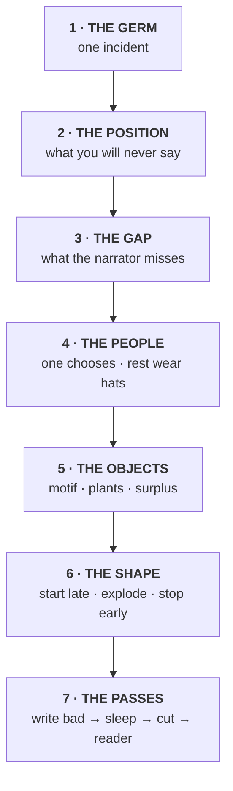
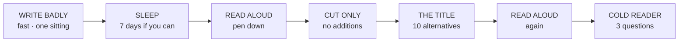

# 🔨 HOW TO BUILD A SHORT STORY
### Seven stages. One question each. Print this.

> **The rule for the whole page: you answer ONE question per stage, in writing, and you do not move on until it is written down.**
> Not thought about. Written. On paper. Where you can see it.



**Stages 1–6 happen before you write a word of the story.** They take about three hours total. Stage 7 is everything else.

---
---

# 1 · THE GERM  ⏱ 20 min

> ### ❓ **What is the ONE incident?**

**One incident. One place. Two people who speak.** That's Barrett, 1900, and nothing since has improved on it.

- [ ] Write it in **one sentence**
- [ ] Say it aloud in **under 15 seconds**, no notes
- [ ] It contains **one thing that happens** — not two

**✅ DONE WHEN:** you can say it to someone in a corridor and they don't ask a follow-up question.

**🆘 STUCK?** Write down the last thing that made you genuinely angry. Change one fact about it. That's your germ.

| Gallery | The germ |
| --- | --- |
| *Mothers* | A boy befriends the neighbour his mother has forbidden |
| *Dite* | A woman drinks a cup of tea her mother made |
| *Serpent* | A man plans to kill his wife and she survives |

> ⛔ **If your sentence has an "and then" in it, you have two stories. Pick one.**

---

# 2 · THE POSITION  ⏱ 20 min

> ### ❓ **What are you SAYING about it — the thing you will never write down in the story?**

**Subject ≠ position.**

```
   SUBJECT                          POSITION
   ───────                          ────────
   "the exploitation of a child"    "inaction is complicity"
   "poverty"                        "literacy is what a mother
                                     couldn't give and a stranger could"
   ❌ not scoreable                  ✅ scoreable
```

- [ ] Write it on **an index card**
- [ ] **Turn the card face down.** That is the last time you look at it
- [ ] Test: **could a reasonable person argue the opposite?**

**✅ DONE WHEN:** you have a sentence someone could disagree with.

**🆘 STUCK?** Finish this out loud, five times fast: *"People think ______ but actually ______."*

> ### ⛔ THE HARDEST RULE ON THIS PAGE
> **That sentence never appears in the story. Not once. Not at the end. Not in the mouth of a wise character.**
>
> The moment it appears you are capped at 3 on the axis it was meant to win. Chantal is capped there right now, by its own two best lines. **Know the price before you pay it.**

---

# 3 · THE GAP  ⏱ 30 min

> ### ❓ **What does the narrator NOT understand that the reader will?**

**This is the engine. Everything in the gallery runs on it.**

```
 KNOWLEDGE
    ▲
    │                                          ╭──────── READER
    │                                    ╭─────╯
    │                             ╭──────╯
    │                      ╭──────╯
    │              ╭───────╯
    │       ╭──────╯
    ├───────╯━━━━━━━━━━━━━━━━━━━━━━━━━━━━━━━━━━━━━━━━━━ NARRATOR
    │
    └──────────────────────────────────────────────────▶  % of story
       start                                        end

          ↑                                ↑
    both know nothing        THIS DISTANCE IS THE STORY
```

**Three ways to open the gap. Pick one.**

| Method | How | Gallery |
| --- | --- | --- |
| **A CHILD** | They report accurately, understand nothing | *Mothers* — condoms as balloons |
| **TIME** | The narrator looks back and still doesn't see it | *Dite* — thirty years, six throats |
| **REFUSAL** | They understand and will not say | *Serpent* — Sita never accuses him. Ever |

- [ ] Name **one thing** the narrator reports accurately and misreads
- [ ] Name **the moment the reader gets there first**

**✅ DONE WHEN:** you can point at one sentence your narrator will write without knowing what it means.

**🆘 STUCK?** Make the narrator **younger**. It fixes this stage more often than anything else.

---

# 4 · THE PEOPLE  ⏱ 30 min

> ### ❓ **Who makes the ONE choice — and who refuses the category you'd put them in?**

```
                    ┌─────────────────┐
                    │   THE CHOOSER   │  ← ONE person. ONE decision,
                    │  never flatten  │     on the page, that costs them
                    └────────┬────────┘
                             │
        ┌──────────┬─────────┼─────────┬──────────┐
        │          │         │         │          │
     ┌──▼──┐    ┌──▼──┐   ┌──▼──┐   ┌──▼──┐   ┌──▼──┐
     │ hat │    │ hat │   │ hat │   │ hat │   │ hat │  ← everyone else:
     └─────┘    └─────┘   └─────┘   └─────┘   └─────┘     ONE tag each
```

### Funny hats — one per person, and only one

| Type | Example |
| --- | --- |
| **Physical quirk** | wears a coat of feathers · never leaves her porch |
| **Verbal style** | won't stop talking · never talks while working |
| **A past event** | *the girl whose family died* · *the widower* |
| **An object** | the cobbler who **knows Jabulanis** |
| **A repeated gesture** | the hundred-rupee note in the folds of the sari |

- [ ] Every named person has **a hat you can say out loud in five words**
- [ ] **ONE person refuses their category** — the villain who isn't, the woman the plot blames who gets her own morning
- [ ] **ONE person wants something the plot doesn't need**

**✅ DONE WHEN:** you have a list of names with a hat beside each, and no blanks.

**🆘 STUCK?** Give them **an object and a debt.** Who owes them, and what do they carry?

> ⛔ **Flatten everybody. Never flatten the chooser.** A flat protagonist is the one thing that breaks a story outright.

---

# 5 · THE OBJECTS  ⏱ 40 min

> ### ❓ **What recurs, what is buried, and what serves nothing at all?**

**Three lists. Written. Now.**

## 5a · THE MOTIF — one thing, 5–6 times, never explained

```
 ●──────────●─────────●───────────●──────────●──────●
 2%        18%       35%         54%        78%    92%

 pick ONE:  a body part · an object · a repeated action · a word
```

*Dite* uses **the throat** — under a cane, in a star school, in bed, in a break-up, and finally reading a colonial ledger. **Six placements. Zero explanation.** That is the entire delivery system for its controlling idea.

- [ ] The motif is **physical**
- [ ] It appears **at least five times**
- [ ] **You never once say what it means**

## 5b · THE PLANTS — 2 things, buried early, detonated late

```
0%                                                    100%
├────●───────────────────────────────────────────●─────┤
     ↑                                           ↑
   PLANT                                       PAYOFF
   looks like ordinary detail            reorganises the plant

   Dite:  grocer's credit notebook (13%) ──▶ indenture ledger (92%)
   Dite:  the cautionary woman (38%) ──▶ she is Vandana's mother (80%)
```

- [ ] Plant #1 looks like **furniture** when you read it
- [ ] The distance is **more than half the story**

## 5c · THE SURPLUS — 6+ details that serve nothing

> **THE CUT TEST: delete it. Does the plot notice?**
> **No, and the story is poorer → it's surplus. Keep it.**
> **No, and nothing changes → it's padding. Cut it.**

- [ ] Six or more
- [ ] At least one is **a person whose life the story does not follow**
- [ ] At least one is **the most memorable thing in the story**

**🆘 STUCK?** Write **twenty details about the place**, then cross out every one that could possibly matter later. What's left is your surplus.

> This is the axis Chantal scores **2** on, and it is the lowest score anywhere in the vault. There is no Pinto, no driving school, no woman on a porch she never leaves.

---

# 6 · THE SHAPE  ⏱ 40 min

> ### ❓ **Where does it start, where does it blow up, where does it stop?**

```
     START                    EXPLOSION                     STOP
       │                          │                          │
       ▼                          ▼                          ▼
   ┌───────────────────────────────────────────────────────────┐
   │  scene  │  scene  │  scene  │ ★★★★ │  scene  │  scene  │  │
   └───────────────────────────────────────────────────────────┘
   0%                                                        100%
       ↑                          ↑                       ↑
   start AFTER          everything before          delete the last
   you think            it re-reads at once        two paragraphs
```

## 6a · START LATE

- [ ] **Delete the first three paragraphs you wrote.** Start on an action or a line of dialogue
- [ ] Let the reader be confused for a moment. That's allowed. That's good

## 6b · THE SCENES

- [ ] Number them
- [ ] Mark **+** or **−** at the start and end of each
- [ ] Any scene where the charge doesn't flip: **either fix it or know why it refuses**

## 6c · THE EXPLOSION — exactly one

> **The moment that makes everything before it mean something different.**

**It can go anywhere.** The gallery proves it:

```
0%─────────25%─────────50%─────────75%────────100%
            ▲           ▲            ▲   ▲
        Mothers      Serpent     Chantal Dite
         (25%)        (50%)       (78%)  (78%)
```

- [ ] You can name **the page it happens on**
- [ ] It is delivered by **something other than the narrator explaining it** — a minor character's line, a document, an object

## 6d · THE GAPS — what you refuse to show

- [ ] Write the sentence: **"I am not going to describe ______."**
- [ ] Cut the scene everyone expects. Keep only the residue — a missing sandal, a muddied wrap

## 6e · STOP EARLY

- [ ] Write your ending
- [ ] **Delete the last two paragraphs. Read it aloud.**
- [ ] Delete two more. Read it aloud
- [ ] Keep the shortest one that still lands

**🆘 STUCK on the ending?** Find the sentence where you started *reaching*. It's usually the first one after the true ending, and usually the one you're proudest of.

---

# 7 · THE PASSES  ⏱ weeks

> ### ❓ **Have you let anyone who is not you read it?**

**Fixed order. Never combine two.**



| Pass | Rule |
| --- | --- |
| **1 · Write badly** | Banish the critic. Compression happens later, never now |
| **2 · Sleep** | Seven days. You cannot see it before then |
| **3 · Read aloud** | **Pen down.** Mark only where you stumble or get bored |
| **4 · Cut** | **Deletions only.** No additions, no polishing, no rewriting |
| **5 · The title** | Ten alternatives. **Three must come from the last 10% of the text** |
| **6 · Read aloud** | Again. Out loud. Yes, again |
| **7 · Cold reader** | Below 👇 |

### The three questions — ask them 24 hours after they read it

1. **What do you remember?** *(Score the first thing they name, not the most.)*
2. **Whose story was it?** *(A wrong answer is data, not an error.)*
3. **What was it about?** *(If they answer with the subject, your position never landed.)*

**✅ DONE WHEN:** someone who is not you has answered all three.

> ⛔ **You cannot do stage 7 alone.** Every instrument in this vault says so. It is a phone call, not a craft problem.

---
---

# 📄 THE ONE PAGE
### Print this. One sheet, one story. Fill it in before you write.

```
STORY: ______________________________     DATE: ____________

1 · GERM (one sentence, 15 seconds)
   ______________________________________________________

2 · POSITION (never appears in the story)
   ______________________________________________________
   ⚠ card face down after writing

3 · GAP    narrator misses: _________________________________
           reader gets it at: _______________________________

4 · PEOPLE
   CHOOSER: ____________  their ONE decision: _______________
   ┌─────────────────┬──────────────────────────────────────┐
   │ NAME            │ HAT (5 words)                        │
   ├─────────────────┼──────────────────────────────────────┤
   │                 │                                      │
   │                 │                                      │
   │                 │                                      │
   │                 │                                      │
   └─────────────────┴──────────────────────────────────────┘
   refuses their category: ___________________________________
   wants something the plot doesn't need: ____________________

5 · OBJECTS
   MOTIF: ______________  placements: ___ ___ ___ ___ ___ ___
   PLANT 1: ____________ (at __%) ──▶ pays off at __%
   PLANT 2: ____________ (at __%) ──▶ pays off at __%
   SURPLUS:  1_________  2_________  3_________
             4_________  5_________  6_________

6 · SHAPE
   STARTS ON (action/line): __________________________________
   EXPLOSION at ___% : _______________________________________
   I AM NOT GOING TO DESCRIBE: _______________________________
   ENDS ON: __________________________________________________

7 · COLD READER: __________________  asked on: ____________
```

---

# 🔧 IF THE STORY IS DEAD, YOU SKIPPED A STAGE

| Symptom | Skipped |
| --- | :-: |
| "It's well written but I don't care" | **2 — Position** |
| "Nothing surprised me" | **3 — Gap** |
| "Everyone sounds the same" | **4 — Hats** |
| "It feels like a sketch" | **5c — Surplus** |
| "It's beautiful but it's about nothing" | **2 — Position** |
| "I got bored in the middle" | **6b — Scenes don't turn** |
| "The ending disappointed me" | **6e — Stopped too late** |
| "It reads as constructed, not lived" | **5c** and **4** — every object load-bearing, no one has a life |
| "I already knew what it was going to say" | **2** — you said it on the page |

---

# ⚡ THE FIVE-MINUTE VERSION
### When you have no time and need it in your head

> **ONE thing happens.**
> **You have something to say and you never say it.**
> **The reader knows before your narrator does.**
> **One person chooses. Everyone else gets a hat.**
> **One object comes back six times and you never explain it.**
> **Bury two things early. Blow them up late.**
> **Put in six things that don't matter.**
> **Start after the beginning. Stop before the end.**
> **Then give it to a human being.**

## Related

- [[The Three-Week Atelier]] — the 21-day programme that drills all seven stages
- [[15 The Chair Test — Scoring the Hidden Factor]] · [[16 Four Stories Side by Side]]
- [[Dite — ANNOTATED]] · [[Mothers Not Appearing in Search — ANNOTATED]] · [[The Serpent in the Grove — ANNOTATED]]
- [[The Art of Brevity by Grant Faulkner]] · [[Gaiman Advice — MasterClass Notes]] · [[Short Story Writing by Charles Raymond Barrett]]
