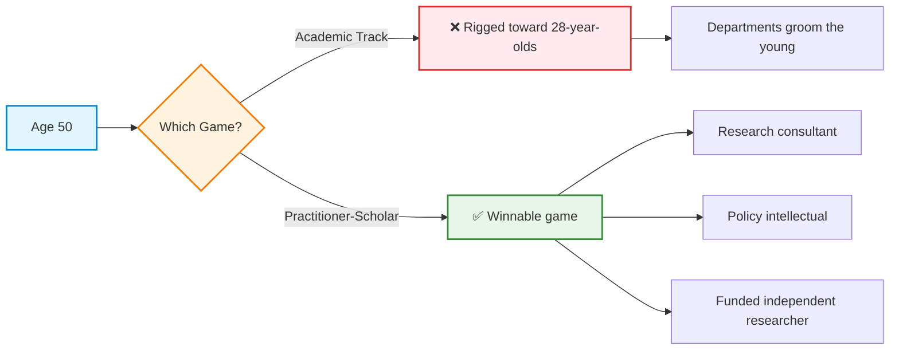
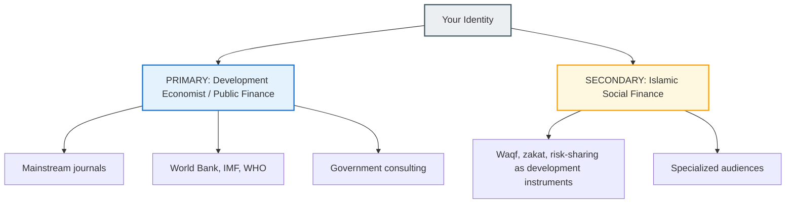
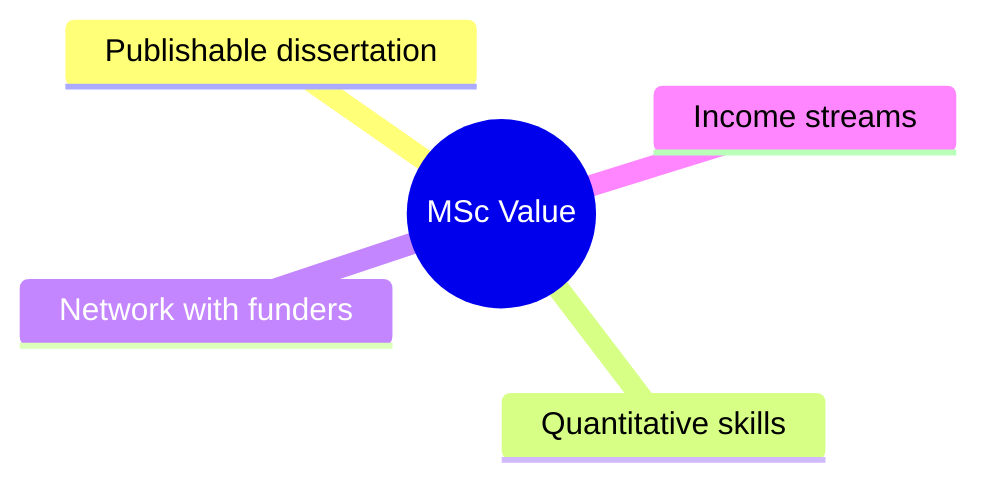
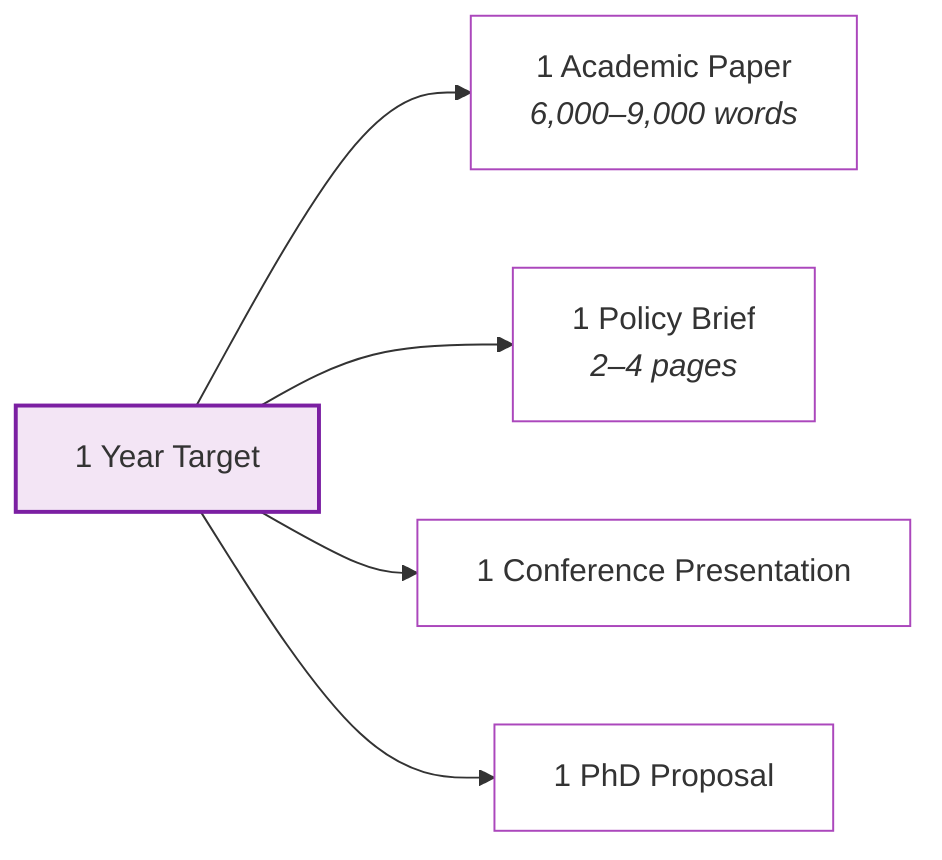
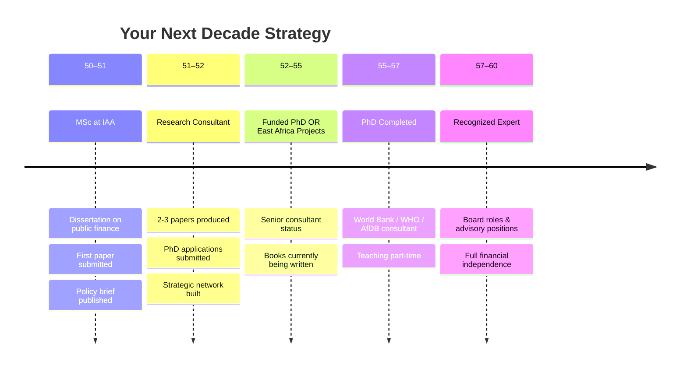
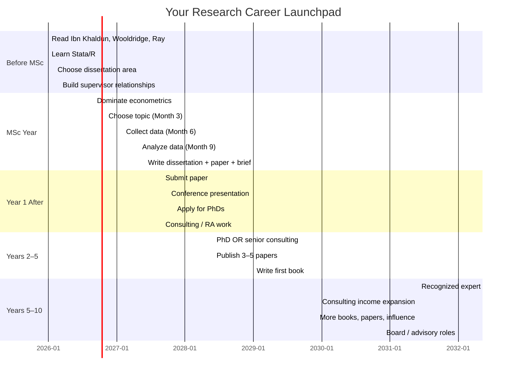
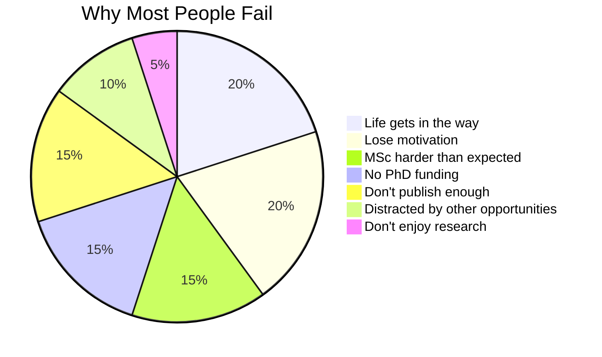
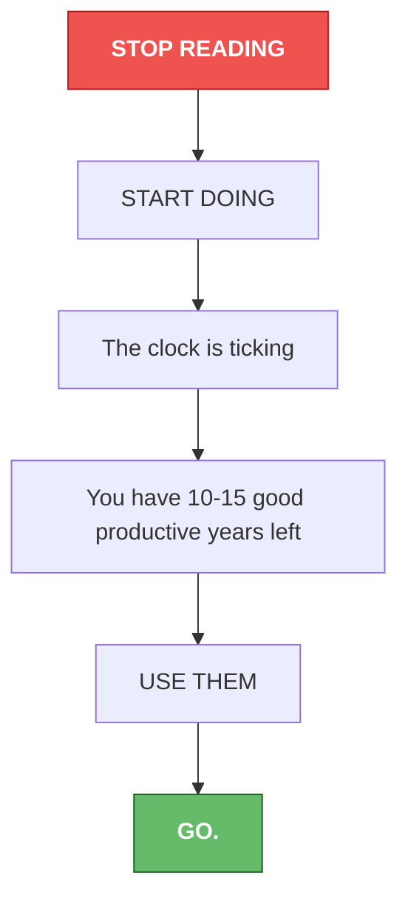

# 🎯 Career Roadmap & Strategic Blueprint
> **Practitioner-Scholar Path: Age 50+ Strategy**

---

## 1. Strategy & Positioning: Choosing the Right Game

---

## 2. Core Identity & Positioning

---

## 3. MSc Value & Annual Output Goals

### Key Pillars of MSc Value

### Yearly Output Matrix

---

## 4. Income Progression & Financial Roadmap

---

## 5. The 10-Year Timeline

---

## 6. Execution Timeline (Gantt Chart)

---

## 7. Risk Analysis: Why Most People Fail

---

## 8. Final Call to Action

